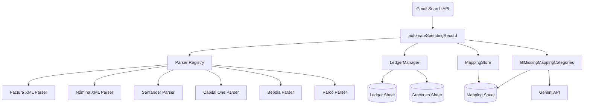

# SYSTEM ENGINE V13: The "Private Accountant"

An automated financial tracking system built with Google Apps Script. It orchestrates the process of fetching bank transactions, merchant receipts, and XML Facturas (CFDI) from Gmail, recording them in a Google Sheet without duplicating entries, and automatically categorizing them using Gemini AI.

## Architecture & Dependency Graph



## How It Works

### Entry Point
The main entry point for the system is `automateSpendingRecord()` located in **`Ledger.js`**. 
This function should be tied to a time-based trigger in Google Apps Script (e.g., run every 15-30 minutes).

### Execution Flow
1. **Search:** The script queries Gmail for unread emails from addresses defined in `SUPPORTED_SENDERS` and `SUPPORTED_FACTURA_SENDERS`.
2. **Parsing:** For each email, it checks the `ParserRegistry` to see if there's a matching rule. It extracts the `merchant` name, `item` description (for XMLs), `amount`, and `account` (last 4 digits).
3. **Deduplication:** Before writing to the sheet, `LedgerManager.appendTransaction()` checks the last 100 rows to see if an expense with the *exact same amount, merchant, and item* already exists. If it does, the new email is considered a duplicate receipt and is skipped.
4. **Recording:** Valid transactions are written to either the `Ledger` or `Groceries` sheet depending on the merchant name. Unique Merchant + Item combinations are saved to the `Mapping` sheet cache.
5. **Cleanup:** Processed emails are marked as read and trashed (or archived for payroll).

### Independent Background Tasks
- **Classification:** `fillMissingMappingCategories()` (from `Clasifier.js`) should be tied to a separate daily trigger. It uses the Gemini API to asynchronously assign categories to any new unmapped items that were cached by the orchestrator, safely handling API quotas.

---

## Core Features

- **Extensible Text Parsing**: Extensible registry to parse HTML/Text transactions from various banks and merchants (Santander, Capital One, Bebbia, Parco).
- **Advanced XML Factura Parsing**: Natively extracts individual `Concepto` (Item) descriptions and automatically adds nested `Traslado` IVA (Taxes) to the total amount from Mexican CFDI 4.0/3.3 attachments.
- **Automated Account Tracking**: Extracts the last 4 digits of the payment method from bank emails.
- **Smart Deduplication**: Prevents double-counting expenses when both the bank and the merchant send a notification for the exact same transaction.
- **Payroll Handling**: Specialized logic for "Nómina" (Payroll) emails, including automatic recording of net pay and deductions (like Infonavit).
- **AI Categorization (Gemini)**: Uses the Gemini Flash API to automatically categorize new items based on your custom `Master_Categories` schema. Includes robust `429 Quota Exceeded` handling to ensure the script never crashes and retries safely on the next run.
- **Composite Merchant Mapping**: Maintains a 4-column `Mapping` sheet cache (`Merchant`, `Item`, `Category`, `Subcategory`) to ensure AI classification only happens once per unique item.

## Spreadsheet Schema Requirements

The system expects the following sheets to exist (or will create them):

### 1. Ledger Sheet (8 Columns)
| done | Date | Type | Merchant / Concept | Item | Amount | Currency | Account |
| :--- | :--- | :--- | :--- | :--- | :--- | :--- | :--- |

### 2. Groceries Sheet (6 Columns)
| Date | Type | Merchant / Concept | Amount | Currency | Account |
| :--- | :--- | :--- | :--- | :--- | :--- |

### 3. Mapping Sheet (4 Columns)
| Merchant Keyword | Item | Category | Subcategory |
| :--- | :--- | :--- | :--- |

### 4. Master_Categories Sheet (2 Columns)
| Category | Subcategory |
| :--- | :--- |

## Prerequisites & Configuration

- Google Cloud Project with the Gemini API enabled.
- **Script Properties** required in Google Apps Script:
  - `GEMINI_API_KEY`: Your Google AI Studio API Key.
  - `NOMINA`: The Gmail label name for payroll emails.

## Deployment

To push your local changes to the Google Apps Script project, run:
```bash
npx clasp push
```

To commit and push these changes to your GitHub repository, run:
```bash
git add .
git commit -m "Add Factura XML parsing, 7-column schema, and Gemini Quota handling"
git push origin main
```