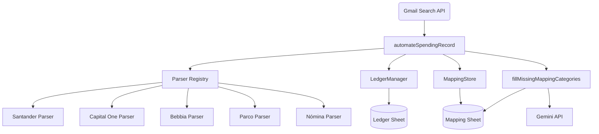

# SYSTEM ENGINE V13: The "Private Accountant"

An automated financial tracking system built with Google Apps Script. It orchestrates the process of fetching bank transactions and merchant receipts from Gmail, recording them in a Google Sheet without duplicating entries, and automatically categorizing them using Gemini AI.

## Architecture & Dependency Graph



## How It Works

### Entry Point
The main entry point for the system is `automateSpendingRecord()` located in **`Ledger.js`**. 
This function should be tied to a time-based trigger in Google Apps Script (e.g., run every 15 minutes).

### Execution Flow
1. **Search:** The script queries Gmail for unread emails from addresses defined in `SUPPORTED_SENDERS`.
2. **Parsing:** For each email, it checks the `ParserRegistry` to see if there's a matching rule. If a match is found, it extracts the `merchant` name and `amount`.
3. **Deduplication:** Before writing to the sheet, `LedgerManager.appendTransaction()` checks the last 100 rows (up to 3 days back) to see if an expense with the *exact same amount* already exists. If it does, the new email is considered a duplicate receipt and is skipped.
4. **Recording:** Valid, non-duplicate transactions are written to the `Ledger` sheet. New merchants are added to the `Mapping` sheet.
5. **Cleanup:** Processed emails are marked as read and trashed (or archived for payroll).
6. **Classification:** Finally, `fillMissingMappingCategories()` (from `Clasifier.js`) is called to use the Gemini API to assign categories to any new merchants.

---

## How to Extend the System

As you add new services, you might receive receipts directly from merchants (like Uber, Netflix, etc.). You can easily add them to the system to be parsed and deduplicated against your bank notifications.

### Step 1: Add the Sender Email
Open `Ledger.js` and add the merchant's email address to the `SUPPORTED_SENDERS` array at the top of the file:
```javascript
const SUPPORTED_SENDERS = [
  "santander@envio.santander.com.mx",
  // ... existing senders
  "receipts@newmerchant.com" // <-- Add new sender here
];
```

### Step 2: Register the Parser
Scroll down to the `ParserRegistry` array and add a new block that tells the script how to match this specific email:
```javascript
const ParserRegistry = [
  // ... existing registries
  {
    match: (ctx) => ctx.from.includes("newmerchant.com"),
    parse: (ctx) => {
      const result = Parsers.newMerchant(ctx.bodyHtml); // Call your custom parser
      return { 
        success: result.amount > 0, 
        type: "Expense", 
        merchant: result.merchant, 
        amount: result.amount, 
        currency: "MXN", 
        isNomina: false 
      };
    }
  }
];
```

### Step 3: Write the Custom Parsing Logic
Scroll down to the `Parsers` object and write the logic to extract the data from the email's body (usually via Regular Expressions).
```javascript
const Parsers = {
  // ... existing parsers
  
  newMerchant: function(bodyHtml) {
    // Example: Find the amount following a dollar sign
    const amountMatch = bodyHtml.match(/\$\s*([\d,.]+)/);
    const amount = amountMatch ? parseFloat(amountMatch[1].replace(/,/g, '')) : 0;
    
    return {
      merchant: "New Merchant Name",
      amount: amount
    };
  }
};
```

## Features

- **Automated Parsing**: Extensible registry to parse transactions from various banks and merchants.
- **Smart Deduplication**: Prevents double-counting expenses when both the bank and the merchant send a notification for the same transaction.
- **Payroll Handling**: Specialized logic for "Nómina" (Payroll) emails, including automatic recording of net pay and deductions.
- **AI Categorization**: Uses the Gemini Pro API to automatically categorize new merchants.
- **Merchant Mapping**: Maintains a `Mapping` sheet to cache merchant names and categories.

## Prerequisites & Configuration

- A Google Spreadsheet with: `Ledger`, `Mapping`, and `Master_Categories` sheets.
- Google Cloud Project with the Gemini API enabled.
- **Script Properties** required:
  - `GEMINI_API_KEY`: Your Google AI Studio API Key.
  - `NOMINA`: The Gmail label name for payroll emails.